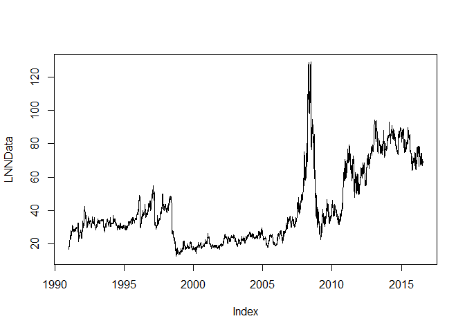
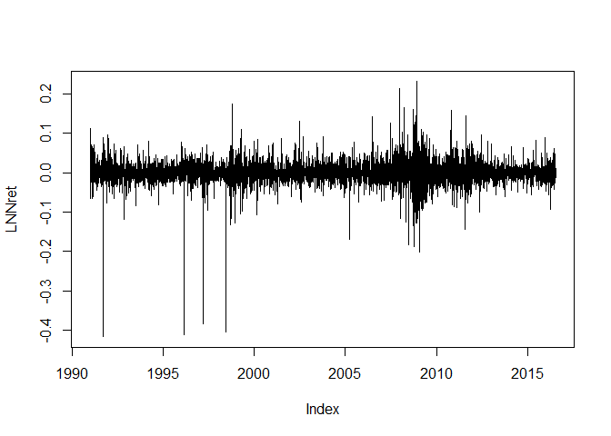
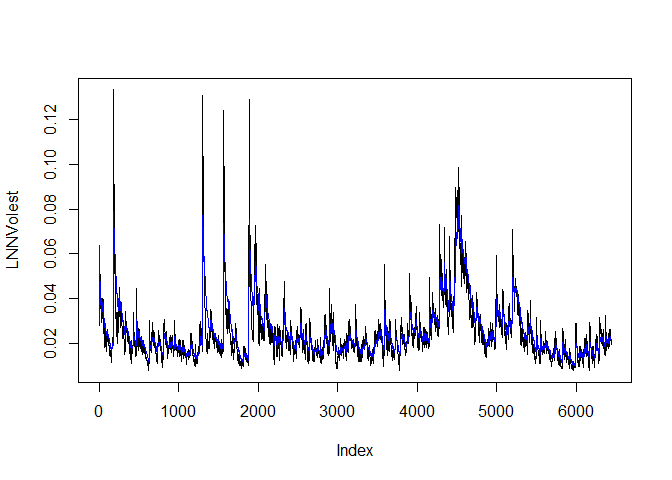

# LNNFinancialDataAnalysis
Sandhya Amaresh  
July 20, 2016  


## R Markdown
#### The following Financial Data analysis is done on the Stock Symbol LNN
#### The Steps 
#### 1.	Download the data. 
#### The library required - tseries


```r
library(tseries)
```

```
## Warning: package 'tseries' was built under R version 3.3.1
```

```r
LNNData <- get.hist.quote('LNN',quote="Close")
```

####Examine the data

```r
plot(LNNData)
```

<!-- -->

#### 2. Calculate log returns.

```r
LNNret <- log(lag(LNNData)) - log(LNNData)
plot(LNNret)
```

<!-- -->
#### 3. Calculate volatility measure.

```r
LNNVol <- log(lag(LNNData)) - log(LNNData)
```
#### 4. Calculate volatility measure with a continuous lookback window.

```r
getVol <- function(d, logrets)
{
	var = 0
	lam = 0
	varlist <- c()
	for (r in logrets) {
		lam = lam*(1 - 1/d) + 1
   	var = (1 - 1/lam)*var + (1/lam)*r^2
		varlist <- c(varlist, var)
	}
	sqrt(varlist)
}
LNNVolest <- getVol(10,LNNret)
LNNVolest2 <- getVol(30,LNNret)
LNNVolest3 <- getVol(90,LNNret)
```
#### 5. Plot the results with a volatility curve overlay.

```r
plot(LNNVolest,type="l")
lines(LNNVolest2,type="l",col="red")
lines(LNNVolest2,type="l",col="blue")
```

<!-- -->
